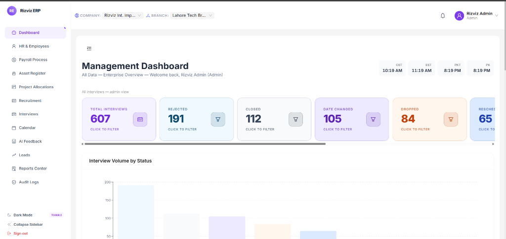

<div align="center">



<br/><br/>

# ✦ Rizviz ERP — Interviews Portal

**A full-stack, enterprise-grade Recruitment & Interview Management System**  
built for Rizviz International Impex — managing candidates, interviews, feedback, leads, and real-time notifications from a single elegant platform.

<br/>

[](https://reactjs.org/)
[](https://dotnet.microsoft.com/)
[](https://ant.design/)
[](https://tailwindcss.com/)
[](https://www.microsoft.com/en-us/sql-server)
[](https://dotnet.microsoft.com/apps/aspnet/signalr)

</div>

---

## ✦ Overview

Rizviz ERP is a **production-ready, mobile-responsive** recruitment portal designed for internal HR teams. It provides a unified workspace to manage the full interview lifecycle — from initial candidate sourcing through to placement, with AI-assisted feedback generation, Google Sheets sync, and real-time push notifications.

---

## ✦ Key Features

| Module | Capability |
|---|---|
| 🗂 **Interviews** | Full CRUD, Excel sync, status tracking, smart filters, grid/list view |
| 📅 **Calendar** | Monthly interview calendar with chip-based event visualization |
| 🤖 **AI Feedback** | Voice recording → Urdu/English transcription → AI enhancement via Groq |
| 👥 **Candidates** | Candidate profiles linked to interview history and status drawers |
| 📊 **Dashboard** | Live KPI cards, Recharts bar/line/pie charts, dark & light mode |
| 📋 **Leads** | Lead management with outcome tracking and recruiter assignment |
| 🔔 **Notifications** | Real-time SignalR push alerts for interview changes |
| 📤 **Google Sheets Sync** | Bidirectional sync — feedback auto-appended to Google Sheet on save |
| 👤 **User Management** | Admin role with first-login setup flow and branch/company switching |
| 📱 **Mobile Responsive** | Full mobile optimization — touch-friendly drawers, swipe-scroll tables, responsive modals |

---

## ✦ Tech Stack

### Frontend
- **React 18** + **Redux Toolkit** (RTK Query for API state)
- **Ant Design 5** — component library
- **Tailwind CSS 3** — utility-first styling
- **Recharts** — data visualization
- **Microsoft SignalR** — real-time WebSocket client
- **Day.js** — date handling

### Backend
- **ASP.NET Core 8** Web API
- **Entity Framework Core** + **SQL Server 2019**
- **SignalR Hubs** — real-time notification broadcasting
- **Google Sheets API** — feedback persistence layer
- **Groq AI API** — Urdu/English transcription and enhancement
- **JWT Authentication** with role-based access control

---

## ✦ Project Structure

```
RizvizERP/
├── RizvizERP.API/          # ASP.NET Core backend
│   ├── Controllers/        # REST API endpoints
│   ├── Models/             # EF Core entity models
│   ├── Services/           # Business logic & integrations
│   ├── Hubs/               # SignalR notification hub
│   ├── Migrations/         # EF Core database migrations
│   └── DTOs/               # Data transfer objects
│
├── rizviz-frontend/        # React frontend
│   └── src/
│       ├── pages/          # Interviews, Dashboard, Calendar, Leads, Feedback…
│       ├── components/     # StatCard, TopNavbar, Drawers, MainLayout…
│       ├── store/          # Redux slices + RTK Query API
│       └── utils/          # Status helpers, table columns
│
├── scripts/                # PowerShell startup & SQL migration scripts
└── docs/                   # Admin manual & screenshots
```

---

## ✦ Getting Started

### Prerequisites
- Node.js 18+
- .NET 8 SDK
- SQL Server 2019 (or Express)
- Google Cloud credentials JSON (for Sheets sync)

### 1 — Backend

```bash
# Configure your connection string in appsettings.json
cd RizvizERP.API
dotnet restore
dotnet ef database update
dotnet run
# API runs at http://localhost:5000
```

### 2 — Frontend

```bash
cd rizviz-frontend
npm install
npm start
# App runs at http://localhost:3000
```

### 3 — Quick Start (PowerShell)

```powershell
# Start SQL Server, API, and frontend in one go
.\scripts\start-api.ps1
.\scripts\start-frontend.ps1
```

---

## ✦ Environment Variables

Create a `.env` file in the project root (never commit this):

```env
REACT_APP_API_URL=http://localhost:5000/api
```

And in `RizvizERP.API/appsettings.json`:

```json
{
  "ConnectionStrings": {
    "DefaultConnection": "Server=...;Database=RizvizERP;..."
  },
  "Jwt": { "Secret": "your-jwt-secret" },
  "GoogleSheets": { "SpreadsheetId": "your-sheet-id" },
  "Groq": { "ApiKey": "your-groq-key" }
}
```

---

## ✦ Roles & Access

| Role | Access |
|---|---|
| **Admin** | Full access — all modules, user management, Excel upload |
| **Interviewee** | Interviews page — own records only, feedback submission |
| **Job Hunter** | Interviews page — filtered by assigned stack |
| **Both** | Dashboard + Interviews — combined recruiter view |

---

## ✦ Mobile Responsiveness

The portal is fully optimized for mobile devices:

- 📱 Drawers use `Math.min(width, 100vw)` — full-screen on phones
- 🗓 Calendar grid wraps in a horizontal scroll container (`minWidth: 560px`)
- 📊 Status card strip is swipe-scrollable on narrow viewports
- 🔲 All modals capped at `95vw` on small screens
- 📝 Multi-column forms collapse to single column below `sm` breakpoint

---

## ✦ License

This project is proprietary software developed for **Rizviz International Impex**.  
All rights reserved © 2026 Rizviz Int. Impex.

---

<div align="center">

Made with ❤️ by Qamer Hassan

</div>
